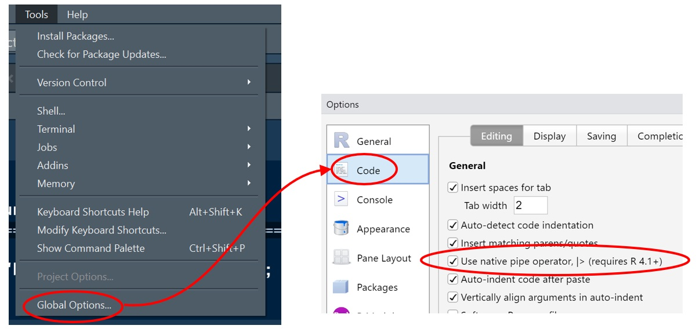
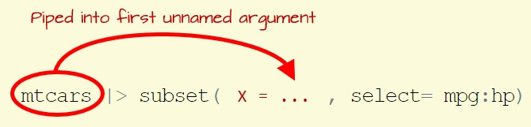

```{r setup, include=FALSE}
knitr::opts_chunk$set(echo = TRUE)
options(scipen = 999)
```

# The native pipe

## Pipe background

While piping operations are not uncommon in many programming environments, piping has only recently found its way into the R programming environment by way of  Stefan Milton Bache's `magrittr` package (now part of the tidyverse suite of packages). Its infix operator is written as `%>%`.

## So why bother with a pipe? 

Take the following series of operations:

```{r}
dat1 <- subset(mtcars, select = c(hp, mpg))
summary(dat1)
```
The `mtcars` dataframe is going through two operations: a table subset, then a summary operation. This approach requires that an intermediate object be created.

A more succinct chunk would look like this:

```{r}
summary( subset(mtcars, select = c(hp, mpg)))
```

However, we are trading readability for succinctness.

A compromise between the two using the pipe looks like this:

```{r}
library(magrittr)
mtcars %>% 
  subset(select = mpg:hp) %>%
  summary()
```

This approach avoids the need for intermediate objects while offering an easy to follow workflow.

## A pipe was not native to R ... until now

R version 4.1 introduces the new native pipe: ` |> `. It behaves much like `%>%`, at least from the user's perspective. So, the above code chunk can be written without relying on the `magrittr` package as follows:

```{r}
mtcars |> 
  subset(select = mpg:hp) |> 
  summary()
```

## RStudio shortcut key

RStudio offers the shortcut key for the `magrittr` pipe: `ctr + shift + M` on Windows machines and `cmd + shift + M` on Macs.

RStudio does not yet offer a dedicated shortcut key for the native pipe but it does offer the option to choose which pipe to assign to that shortcut key. This option can be specified via the *Options* menu (note that as of this writing, this feature is only available in the preview version of RStudio).





## What does a pipe do exactly?

A pipe feeds the contents (or output) from the left hand side (LHS) into the first *unnamed* argument of the right hand side (RHS) function. So in the following example, the pipe feeds the `mtcars` dataframe into the first argument of `subset()`.

```{r eval= FALSE}
mtcars |> subset(select = mpg:hp)
```

The first argument in `subset` is the data object argument, `x`. Note that `subset` has several methods. If a dataframe is passed to `subset`, the method called is `subset.data.frame()`. We can list its arguments using the following command.

```{r}
formalArgs(subset.data.frame)
```
The first argument is `x =` (the input dataframe). So in the above piping operation `mtcars` is piped as a parameter to the `x` argument of the `subset` function.

{width=41%}

Knowing this can help troubleshoot unwelcome scenarios. For example, what happens if the LHS gets piped to a function on the RHS that does not have input data as its first argument?


```{r ,error=TRUE, fig.show='hide'}
mtcars |> lm(hp ~ mpg )
```

`lm` has its data input argument, `data`, as its second argument. Hence, the pipe is assigning `mtcars` to   `formula` which is the first argument in the `lm` function. 

```{r}
formalArgs(lm)
```

You'll note that we defined the formula, `hp ~ mpg`, in the above code chunk, however, it's not being explicitly assigned to the `formula` argument. So R is interpreting the above piping operation as:

```{r eval = FALSE}
lm(formula = mtcars, data = hp ~ mpg)
```

which generates an error message.

One solution is to explicitly **name** the `formula` argument to prevent the pipe from assigning `mtcars` to `formula`:

```{r ,error=TRUE, fig.show='hide'}
mtcars |> lm(formula = hp ~ mpg )
```

In the above example, the `formula =` argument is explicitly spelled out thus forcing the pipe to look for the next argument not explicitly named in the code chunk. Once found, it assigns the LHS as that argument's parameter. In the above code chunk, this next argument is `data` (which is what we want o pipe `mtcars` into). This works with both `|>` and `%>%`.


## Naming arguments may not always work

In some cases, naming arguments (as demonstrated in the previous example) may not be suitable. For example the following plot function does not generate a scatter plot of `hp` vs `mpg` as we might have expected, even though we are explicitly naming the argument being assigned the `hp ~ mpg` formula.

```{r fig.height=4, fig.width=4, echo=2, warning=FALSE}
OP <- par(mar=c(2,2,1,1))
mtcars |>  plot(formula = hp ~ mpg)
par(OP)
```

While the above does not generate an error, it's not generating the desired plot (i.e. a single scatter plot of `hp` vs. `mpg`).

Even though the generic `plot` function accepts a formula, it does not have `formula` as an argument:

```{r}
args(plot)
```

So `plot` ignores the `formula = hp ~ mpg` argument in our code chunk and is, in essence, running the code `plot(mtcars)` which will generate scatter plot matrices for all combinations of paired variables in the data.

So why will `plot` accept a formula and yet not recognize the `formula` argument? Being a generic method, `plot` will pass the arguments to the `plot` method it *thinks* is needed given the argument type. Here, the plot method needed for a formula is `graphics:::plot.formula`. So, to make use of a named argument, you would need to modify the previous chunk by specifying the `plot.formula` method as follows:

```{r fig.height=2, fig.width=2, echo=2, warning=FALSE}
OP <- par(mar=c(2,2,1,1))
mtcars |>  graphics:::plot.formula(formula = hp ~ mpg)
par(OP)
```

This approach to solving named argument roadblocks can be time consuming and lead to frustration. A few (simpler) solutions are presented next.


## `%>%` offers the placeholder `.`, ` |> ` does not

One notable difference between ` |> ` and `%>%` is the lack of a placeholder. Magritter's `%>%` offers the `.` placeholder which can be used to explicitly specify where the LHS is to be placed in the RHS's function. For example, to circumvent the missing `formula` argument from the generic `plot` function, you could place a `.` in the plot function where you would want the LHS to be piped into. For example:

```{r fig.height=2, fig.width=2, echo=2, warning=FALSE}
OP <- par(mar=c(2,2,1,1))
  mtcars %>% plot( hp ~ mpg, data = . )
par(OP)
```

Note that the only argument being named is `data`--the argument to receive the LHS.

The native pipe does not have a placeholder. This is to maintain its ["viable syntax transformation"](https://stat.ethz.ch/pipermail/r-devel/2020-December/080179.html).

A solution that will work with ` |> ` (and one that also works with `%>%`) is the embedding an anonymous function.

## Using anonymous functions in pipes

An anonymous function is a function that is not assigned a name. For example, the following function **is** a named function.

```{r}
my_fun <- function(x) sqrt(x)
```

The above code chunk creates a function named `my_fun()`. Naming a function allows us to reuse this function anywhere in an R session. For example,

```{r}
my_fun(20)
my_fun(3)
```

An anomalous function is only used once and is usually embedded inside other functions such as `apply` or its many variants. The structure of an anonymous function looks like:

```{r eval = FALSE}
(function(x) sqrt(x)) ()
```

Continuing with the `plot` function example, using an anonymous function to explicitly indicate where to place the LHS in the RHS function would look like:

```{r fig.height=2, fig.width=2, echo=2, warning=FALSE}
OP <- par(mar=c(2,2,1,1))
  mtcars |> (function(x) plot(mpg ~ hp, data = x)) ()
par(OP)
```

Here, we explicitly define the placeholder name (`x` in the above example). But note that you could use any other accepted names, even the `.` character.

Anonymous functions also work with the `%>%` pipe.

## Differences in performance between `%>%` and `|>`

Under the hood, the native pipe is distinctly different from its magrittr counterpart. `%>%` is a function while ` |> ` is not. This adds a small overhead to the `%>%` operation. ` |> ` is nothing more than a syntactic translation which means that R will parse `10 |> sqrt()` as `sqrt(10)`. On the other hand, `10 %>% sqrt` is parsed as `%>%(10, sqrt())`, i.e. two functions are processed instead of one.

This overhead will not be noticeable to most users. But if you are running a series of piping operations in a loop, that overhead may have a measurable impact in performance. The following plot compares the performance between `sqrt(10)`, `10 |> sqrt()` and `10 %>% sqrt()`. Each code is run 10 million times.

```{r echo = FALSE, fig.width = 5, fig.height = 2.5}
pipes <- bench::mark( `sqrt(10)` = sqrt(10),
                         `10 |> sqrt()` = 10 |> sqrt(),
                        `10 %>% sqrt()` = 10 %>% sqrt(),
                      min_iterations = 10000000
)

pipes.df <- data.frame(Type = rep(names(pipes$expression), 
                                  sapply(pipes$time, length)),
                       Nanoseconds = unlist(pipes$time) * 10^9, row.names = NULL)

library(ggplot2)

pipes.df |> subset(Nanoseconds > 1) |> 
ggplot() + aes(x=Type, y = Nanoseconds +0.00001) + geom_boxplot() +
  scale_y_continuous(trans = "log" , breaks = c(50,100,1000,10000, 100000, 1000000)) +
  coord_flip() +
  ylab("Nanoseconds (log scale)") +
  theme(axis.title.y = element_blank(),
        axis.ticks = element_blank())
```

As expected, `10 |> sqrt()`'s performance is identical to `sqrt(10)` (recall that ` |> ` is a simple syntax transformation and not a function). 

# The formula shorthand `/`

R 4.1 also introduces a shorthand for the `function()` function. This can help reduce code syntax. The shorthand notation may help keep lines of code short when implementing an anonymous function. For example, the following two lines of code perform the exact same operation.

```{r, eval = FALSE}
mtcars |>  ( function(x)  plot(hp ~ mpg, x)) ()
mtcars |>  (        \(x)  plot(hp ~ mpg, x)) ()
```

The shorthand notation can also be used with named functions:

```{r, eval = FALSE}
f1 <- function(x,y) x + y
f1 <-        \(x,y) x + y
```

However, the shorthand notation may impede readability--it's easier to spot  `function` than it is to spot `\` when scanning for a formula definition in an R script.

# New color palettes

R version 4.1 adds new categorical color palettes.  Previous to 4.1, R offered the following categorical color palette:

```{r eval=FALSE}
# Before version 4.1
palette()
``` 

```
[1] "black"   "red"     "green3"  "blue"    "cyan"    "magenta" "yellow"  "gray" 
```

R version 4.1 offers a different set of colors that do a better job in preserving *perceived* consistency in lightness and saturation dimensions.

```{r}
# Version 4.1 and later
palette()
``` 

But R 4.1 offers additional categorical palettes for a total of 16 palettes. The palette names can be listed via the new `palette.pals()` function.

```{r}
palette.pals()
``` 

To view the list of colors associated with a palette (e.g. the `"Accent"` palette), type the following:

```{r}
palette("Accent")
palette()
```

Note that the first line of code in the above code chunk will change the default color palette to `"Accent"` for the current R session. 

```{r fig.width = 3, fig.height= 3, echo=2}
OP <- par(mar = c(2,2,1,0))
boxplot(log(decrease) ~ treatment, data = OrchardSprays,
        col = OrchardSprays$treatment)
text(5,1,"Accent palette", col = "#EE9A00")
par(OP)
```

If you want to revert the palette back to the default, set the palette name to `"R4"`.

```{r}
palette("R4")
palette()
```

```{r fig.width = 3, fig.height= 3, echo=2}
OP <- par(mar = c(2,2,1,0))
boxplot(log(decrease) ~ treatment, data = OrchardSprays,
        col = OrchardSprays$treatment)
text(5,1,"Default palette", col = "#EE9A00")
par(OP)
```

If you want to replicate the default color palette available in R prior to version 4.1, set the palette name to `"R3"`.

```{r}
palette("R3")
palette()
```

```{r fig.width = 3, fig.height= 3, echo=2}
OP <- par(mar = c(2,2,1,0))
boxplot(log(decrease) ~ treatment, data = OrchardSprays,
        col = OrchardSprays$treatment)
text(5,1,"Pre 4.1 palette", col = "#EE9A00")
par(OP)
```

The palettes in R 4.1 vary in the number of color swatches. The following plot shows all colors available for each palette.

```{r echo = FALSE, fig.width = 8, fig.height=5, message=FALSE}
library(ggplot2)
cols <- sapply(palette.pals(), palette.colors, n= NULL, recycle = FALSE)
cols.df <- data.frame(ID = rep(names(cols), sapply(cols, length)),
           Obs = unlist(cols))
cols.df$ID <- factor(cols.df$ID,names(cols) )

ggplot(cols.df) + aes(x=ID) + 
  geom_dotplot(fill=cols.df$Obs,col=cols.df$Obs) + coord_flip() +
  theme_classic() +
  theme(axis.line = element_blank(), 
        axis.title = element_blank(),
        axis.text.x = element_blank(),
        axis.ticks = element_blank())
```

-----

 Manuel Gimond, 2021